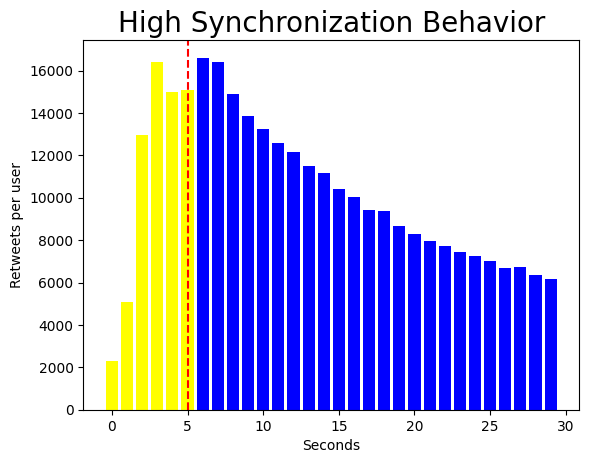
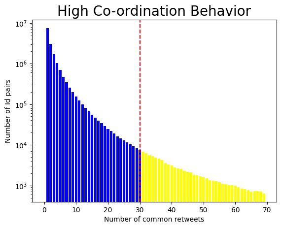

# Semantic web mining
## Project 16 | Group 8

The aim of the project is to find botnets from a twitter dataset using the high-coordination and high-synchronization behaviors of different users.

## Datasets
To save time use the pickle files in the pickle/ folder.
Other large pickle files are :

[coord_graph.pkl](https://drive.google.com/file/d/1rp3L3RY6ieBvR3b-YNve0qOGUyvCEXVp/view?usp=sharing)

[main_df.pkl](https://drive.google.com/file/d/1n-SWmIlzTVkvurzwvvCxTySXDFToMVy4/view?usp=drive_link)

[retweets_df.pkl](https://drive.google.com/file/d/13mAnuK3zYeejb3iaTOjFzu852IOa9nPY/view?usp=drive_link)

[user_df_map.pkl](https://drive.google.com/file/d/1PqCJ8zSTez_EWEzr0GA7OuT4T0KaZ_AI/view?usp=sharing)

The complete dataset can be obtained [here](https://drive.google.com/drive/folders/1NbamglfcP7gL4OTh5F-Ui4RCk0doYKxj?usp=drive_link).

## Bots camps

## Top 25 hashtags used by puppets

## Word cloud of the hashtags

## High synchronization and coordination

    
    

## Network visualization of the coordination behavior of the bots

